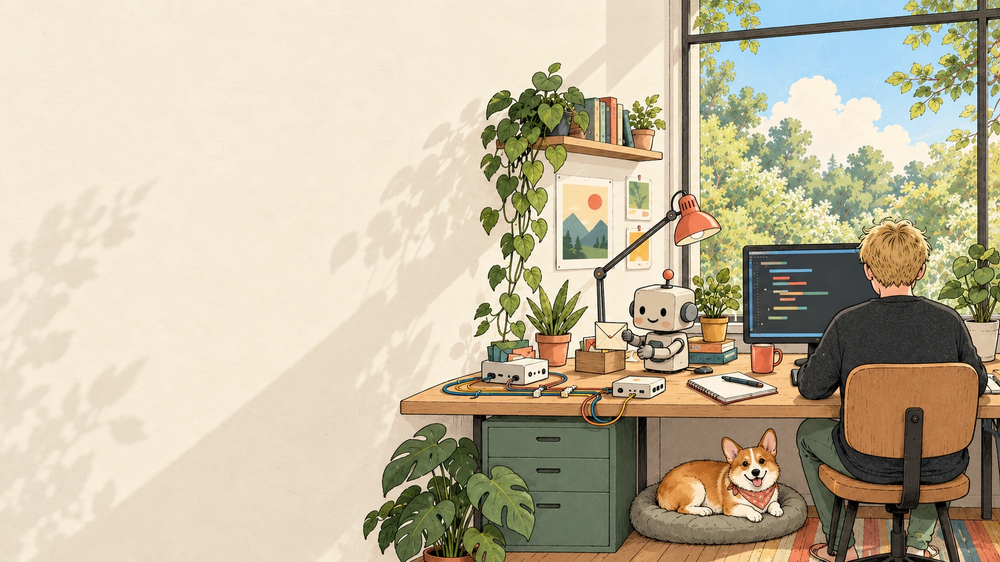

# 🎨 MaxBob — AI & Automation Portfolio

An illustrated portfolio of **AI agents, browser automation, fingerprinting tools and production systems** by Maksym Babenko.

🌐 **[Live portfolio](https://cv.maxbob.xyz/)** · 🐙 **[GitHub profile](https://github.com/mazamaka)** · 📄 **[Download CV](https://cv.maxbob.xyz/assets/Maksym-Babenko-CV.pdf)** · [Resume — EN / RU](https://github.com/mazamaka/resume)



## ✨ What’s inside

- **Project catalog** — selected work, GitHub links, stack tags and case studies.
- **Instant search** — English and Russian queries across curated project content, with suggestions, match highlights and filters.
- **Private project overviews** — reviewed capability summaries alongside public work.
- **Illustrated interface** — project artwork, responsive layouts, keyboard navigation and reduced-motion support.
- **Static delivery** — no backend or API keys needed to serve the site. Search runs in the browser. GitHub star counts refresh from the public API on page load and when returning to the tab; saved counts remain available offline.

## 🛠️ Stack

**React · TypeScript · Tailwind CSS · Motion · GSAP · Lucide**

Built with **esbuild**, with Python scripts for case-study pages and link checks.

## 🚀 Run locally

Install Node.js with npm and Python 3, then:

```sh
npm ci
npm run typecheck
npm run build
npm run check
python3 -m http.server 8000 --directory dist
```

Open [localhost:8000](http://localhost:8000). The checked-in `dist/` can also be served directly.

## 🧭 Update the portfolio

| Content | Source |
| --- | --- |
| Main page, navigation and footer | `dist/index.html` |
| Project descriptions and search content | `src/catalog.json` |
| Featured project selection | `src/projects.ts` |
| Public repository snapshot | `src/repositories.json` |
| Search and gallery components | `src/search.ts`, `components/` |
| Layout and styling | `dist/light-theme.css`, `styles/projects.css` |
| Case-study pages | `scripts/build-cases.py` |
| SEO, structured data and crawler directory | `scripts/site_metadata.py`, `scripts/build-seo.py` |
| Browser icons and social previews | `dist/favicon.svg`, `scripts/build-brand-assets.cjs` |
| Illustrations, font and downloadable CV | `dist/assets/` |

The build replaces the gallery between the `PROJECT-GALLERY` markers and regenerates case-study pages. Keep the main page shell in `dist/index.html`; it is a build input as well as deployable output.

To regenerate the CV, install the optional Python `reportlab` package and run `python3 scripts/build-cv.py`. The ready-to-download PDF is included.

Run `npm run branding` to regenerate the PNG/ICO icons and four 1200 × 630 JPEG link previews. Existing illustrations are read-only inputs. The branding assets are committed, so a regular build does not need to regenerate them.

The shared metadata builder keeps canonical URLs, Open Graph, Twitter cards and JSON-LD consistent across the home page and case studies. `/projects/` exposes the same reviewed catalog summaries in HTML, including when JavaScript is unavailable; private repository links are never generated. The existing page layout, copy and animation files do not depend on this directory. `/sitemap.xml` lists the canonical HTML pages, and `/llms.txt` is an optional navigation aid for tools that support it, not a ranking signal or indexing guarantee.

Crawler access retains the existing allow-all `robots.txt` policy. AI search uses the same public content as visitors; no crawler-only claims, keyword stuffing, invented reviews or hidden private content are added. References: [Google Search AI features](https://developers.google.com/search/docs/appearance/ai-features), [OpenAI crawler controls](https://developers.openai.com/api/docs/bots), [Open Graph](https://ogp.me/).

Publish the contents of **`dist/`** to a static web host. See [deployment notes](DEPLOYMENT.md) and [component notes](COMPONENTS.md).

## 🔎 About the project data

Search uses curated summaries of project capabilities. Private project entries contain descriptions only; their source repositories remain private. The catalog does not fetch private repositories or use credentials at runtime. Star counts use a single public repository-list request for the current account size, with sequential pagination if needed. Requests are deduplicated, rapid tab switches are debounced, and GitHub rate-limit/reset headers are respected. A device-local cache stores the last successful counts; the bundled snapshot is the offline fallback. A small refresh button is available beside the star-update status.

Third-party font and library notices are retained in `dist/assets/fonts/` and `dist/vendor/`.

GitHub API references: [public repositories](https://docs.github.com/en/rest/repos/repos#list-repositories-for-a-user), [rate limits](https://docs.github.com/en/rest/using-the-rest-api/rate-limits-for-the-rest-api).

## 🌐 Languages & appearance

English is the default at `/`; Russian and Ukrainian are available at `/ru/` and `/uk/`. The header language picker preserves the current project page, search query and reading position, even when an older section anchor remains in the URL. Selecting the active language simply closes the menu. Every language has prerendered home, directory and case pages with its own canonical URL and reciprocal `hreflang` links. The downloadable CV remains in English.

Reviewed translations live in `src/locales/`: `ui.json` for shared labels and featured cards, `catalog.json` for searchable project content, and `cases.json` for case studies. Each English key maps to `[Russian, Ukrainian]`. `scripts/build-locales.py` builds the language routes after the English source pages; never edit the generated `dist/ru/` or `dist/uk/` pages directly. Search indexes all three languages locally.

Light mode is the initial theme. The sun/moon control persists an explicit choice in local storage and works without storage as well. `dist/dark-theme.css` contains the evening palette; `src/settings.ts` and `components/theme-image.tsx` switch static and React illustrations. The hero and 12 project scenes have separate generated `*-night-v1.webp` assets, with the original day artwork preserved. No image-generation service is called by the website.
